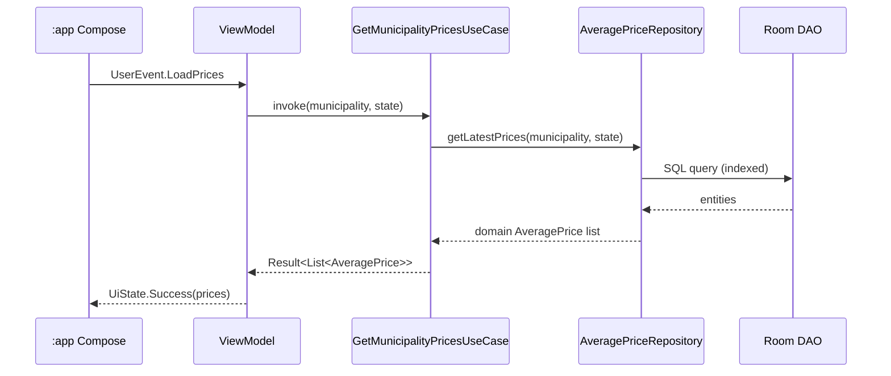
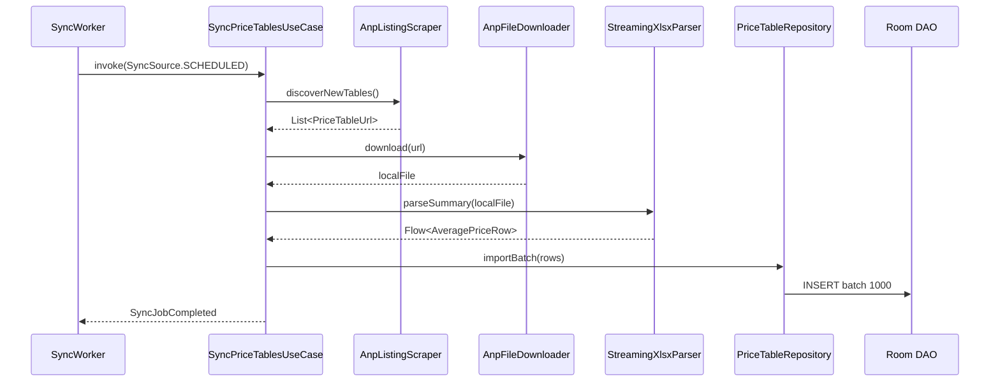
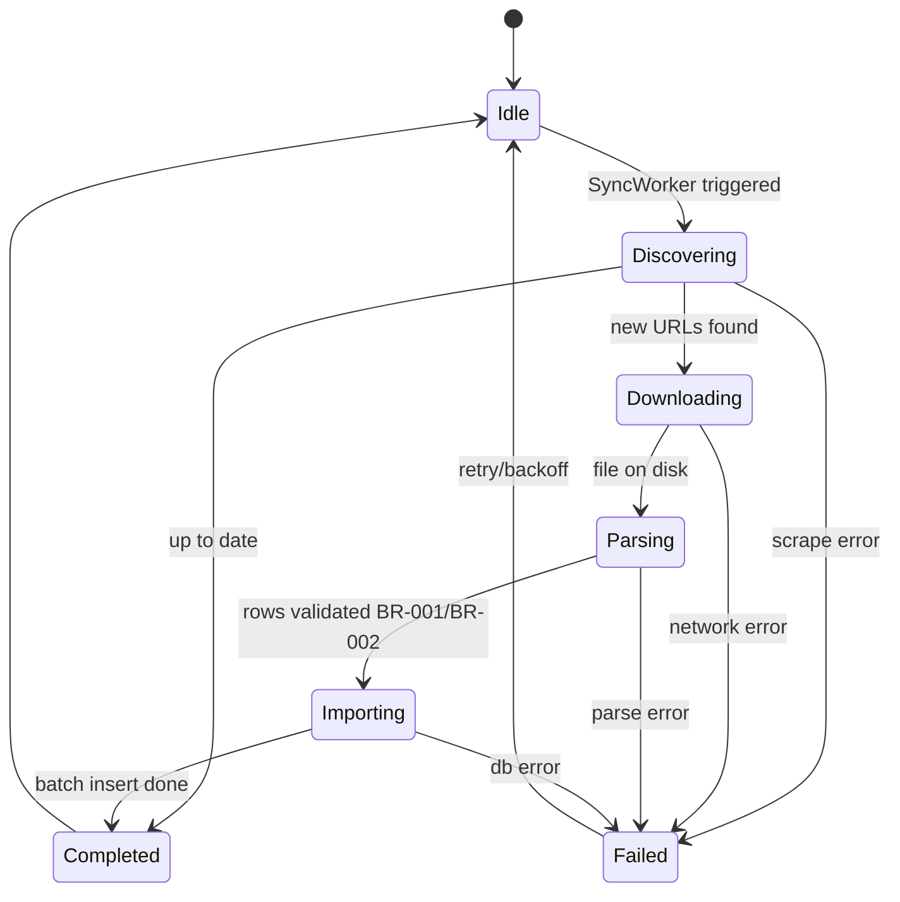

# Architecture

> **Status:** Definitive  
> **Stack reference:** [tech-stack.md](tech-stack.md)  
> **Product contract:** [user-business-logic.md](user-business-logic.md)  
> **Engineering contract:** `.cursor/rules/`

This document defines how the ANP Fuel Prices Android app is structured. All code must conform to the layer rules below.

---

## Architectural style

**Clean Architecture** mapped to four Gradle modules, enforcing unidirectional dependencies from outer layers toward the Domain core.

```
┌──────────────────────────────────────────────────────────────────┐
│  INTERFACES — :app                                               │
│  Jetpack Compose · ViewModels · Navigation · Theme · i18n        │
│  Responsibility: deliver UI, map UiState, dispatch user events     │
│  Must NOT: business rules, SQL, HTTP, XLSX parsing                 │
└────────────────────────────┬─────────────────────────────────────┘
                             │ calls
┌────────────────────────────▼─────────────────────────────────────┐
│  APPLICATION — :application                                      │
│  Use Cases · AppError mapping · orchestration                    │
│  Responsibility: execute UC-001…UC-008, enforce flow order         │
│  Must NOT: Android SDK, Room, OkHttp, Compose                   │
└────────────────────────────┬─────────────────────────────────────┘
                             │ uses
┌────────────────────────────▼─────────────────────────────────────┐
│  DOMAIN — :domain                                                │
│  Entities · Value Objects · Business Rules · Events · Ports       │
│  Responsibility: all business truth (BR-001…BR-015)              │
│  Must NOT: any framework, Android, or I/O                        │
└────────────────────────────▲─────────────────────────────────────┘
                             │ implements ports
┌────────────────────────────┴─────────────────────────────────────┐
│  INFRASTRUCTURE — :data                                          │
│  Room · OkHttp · Jsoup · XlsxParser · WorkManager · Repositories │
│  Responsibility: I/O, persistence, external ANP integration      │
│  Must NOT: Compose, ViewModels, UI logic                         │
└──────────────────────────────────────────────────────────────────┘
```

---

## Module dependency rules

| Rule | Description |
|------|-------------|
| **R-ARCH-01** | Dependencies point inward only — `:domain` has zero module dependencies |
| **R-ARCH-02** | `:application` depends only on `:domain` |
| **R-ARCH-03** | `:data` depends only on `:domain` |
| **R-ARCH-04** | `:app` depends on `:application` and `:data` (for Hilt wiring) |
| **R-ARCH-05** | UI never imports `:data` repository implementations — only use cases |
| **R-ARCH-06** | Domain repository interfaces (ports) live in `:domain` |
| **R-ARCH-07** | ANP Portuguese strings are normalized to domain enums in `:data` mappers |

---

## Package structure

### `:domain`

```
domain/src/main/kotlin/com/anpfuel/domain/
├── model/                    # Entities & aggregate roots
│   ├── PriceSurvey.kt
│   ├── AveragePrice.kt
│   ├── RetailStation.kt
│   └── StationPrice.kt
├── valueobject/              # Immutable, self-validating
│   ├── SurveyWeek.kt         # BR-001
│   ├── FuelProduct.kt
│   ├── BrazilianState.kt
│   ├── BrazilianRegion.kt
│   ├── GeographicScope.kt
│   ├── PriceAmount.kt
│   └── Cnpj.kt
├── rule/                     # Named business rules
│   ├── SurveyWeekValidationRule.kt    # BR-001
│   ├── FuelProductNormalizationRule.kt # BR-002
│   └── SyncJobConcurrencyRule.kt      # BR-015
├── state/                    # State machines
│   ├── SyncJobState.kt
│   └── DataReadinessState.kt
├── event/                    # Domain events (past tense)
│   ├── PriceTableDiscovered.kt
│   ├── PriceTableDownloaded.kt
│   ├── PriceTableImported.kt
│   ├── SyncJobCompleted.kt
│   └── CitySelected.kt
├── repository/               # Ports (interfaces only)
│   ├── PriceTableRepository.kt
│   ├── AveragePriceRepository.kt
│   ├── StationPriceRepository.kt
│   ├── MunicipalitySearchRepository.kt
│   └── UserPreferencesRepository.kt
└── exception/
    └── DomainException.kt
```

### `:application`

```
application/src/main/kotlin/com/anpfuel/application/
├── usecase/
│   ├── sync/
│   │   ├── SyncPriceTablesUseCase.kt          # UC-001
│   │   └── DownloadStationDetailUseCase.kt      # UC-007 subset
│   ├── price/
│   │   ├── GetMunicipalityPricesUseCase.kt    # UC-005
│   │   ├── GetPriceHistoryUseCase.kt          # UC-006
│   │   └── GetStationPricesUseCase.kt         # UC-007
│   ├── vehicle/
│   │   ├── ListVehiclesUseCase.kt             # UC-010
│   │   ├── SaveVehicleUseCase.kt              # UC-010
│   │   ├── DeleteVehicleUseCase.kt            # UC-010
│   │   └── GetTankFillCostEstimatesUseCase.kt # UC-011
│   ├── location/
│   │   ├── SelectLocationUseCase.kt           # UC-003
│   │   ├── SearchMunicipalityUseCase.kt       # UC-004
│   │   └── ResolveDeviceLocationUseCase.kt    # UC-012
│   ├── station/
│   │   └── BuildStationNavigationQueryUseCase.kt # UC-013
│   ├── alert/
│   │   ├── ConfigurePriceDropAlertUseCase.kt  # UC-014
│   │   └── EvaluatePriceDropAlertsUseCase.kt  # UC-014
│   ├── settings/
│   │   ├── GetSettingsUseCase.kt              # UC-008
│   │   ├── UpdatePreferencesUseCase.kt        # UC-008
│   │   └── ClearCacheUseCase.kt               # UC-008
│   └── onboarding/
│       └── CompleteOnboardingUseCase.kt       # UC-002
├── error/
│   └── AppError.kt                            # Maps to i18n in :app
└── dispatcher/
    └── AppDispatchers.kt                      # IO / Default abstraction
```

### `:data`

```
data/src/main/kotlin/com/anpfuel/data/
├── local/
│   ├── AnpFuelDatabase.kt
│   ├── dao/
│   │   ├── SurveyWeekDao.kt
│   │   ├── AveragePriceDao.kt
│   │   ├── StationPriceDao.kt
│   │   ├── MunicipalityFtsDao.kt
│   │   └── VehicleDao.kt
│   ├── entity/                               # Room entities (infra, not domain)
│   └── preferences/
│       ├── UserPreferencesDataStore.kt
│       └── GeocodeCacheDataStore.kt          # UC-012 Nominatim cache
├── remote/
│   ├── AnpListingScraper.kt                  # Jsoup + OkHttp
│   ├── AnpFileDownloader.kt                  # OkHttp streaming download
│   └── NominatimReverseGeocodeClient.kt      # UC-012
├── parser/
│   ├── StreamingXlsxParser.kt                # Low-level ZIP/XML streaming
│   ├── WeeklySummarySheetParser.kt           # resumo_semanal_lpc
│   └── StationDetailSheetParser.kt           # revendas_lpc
├── mapper/
│   ├── AnpProductMapper.kt                   # BR-002 Portuguese → FuelProduct
│   ├── AnpDateMapper.kt                      # Excel serial → LocalDate
│   └── EntityDomainMapper.kt
├── repository/
│   ├── PriceTableRepositoryImpl.kt
│   ├── AveragePriceRepositoryImpl.kt
│   ├── StationPriceRepositoryImpl.kt
│   ├── MunicipalitySearchRepositoryImpl.kt
│   ├── UserPreferencesRepositoryImpl.kt
│   ├── VehicleRepositoryImpl.kt              # UC-010
│   └── ReverseGeocodeRepositoryImpl.kt       # UC-012
├── worker/
│   ├── SyncWorker.kt                         # WorkManager — UC-001
│   ├── RetentionCleanupWorker.kt             # BR-013
│   └── PriceDropEvaluationWorker.kt          # UC-014
└── di/
    ├── DatabaseModule.kt
    ├── NetworkModule.kt
    └── RepositoryModule.kt
```

### `:app`

```
app/src/main/kotlin/com/anpfuel/app/
├── AnpFuelApplication.kt                     # @HiltAndroidApp
├── navigation/
│   ├── AnpNavGraph.kt
│   └── Routes.kt
├── theme/
│   ├── Theme.kt                              # Material 3
│   ├── Color.kt
│   └── Type.kt
├── ui/
│   ├── onboarding/                           # UC-002
│   ├── home/                                 # UC-005 entry
│   ├── search/                               # UC-004
│   ├── location/                             # UC-003
│   ├── prices/                               # UC-005, UC-006
│   ├── stations/                             # UC-007, UC-013
│   ├── vehicle/                              # UC-010
│   └── settings/                             # UC-008
├── viewmodel/                                # One ViewModel per screen
│   ├── HomeViewModel.kt
│   ├── SearchViewModel.kt
│   └── ...
├── mapper/
│   └── AppErrorMapper.kt                     # AppError → stringResource key
└── di/
    └── AppModule.kt
```

---

## Data flow

### Read path (UC-005 — view municipality prices)



### Write path (UC-001 — sync price tables)



---

## Use case → module mapping

| Use Case | Application class | Domain ports | Infrastructure |
|----------|-------------------|--------------|----------------|
| UC-001 Sync | `SyncPriceTablesUseCase` | `PriceTableRepository` | Scraper, Downloader, Parser, Worker |
| UC-002 Onboarding | `CompleteOnboardingUseCase` | `UserPreferencesRepository` | DataStore |
| UC-003 Select location | `SelectLocationUseCase` | `AveragePriceRepository`, `UserPreferencesRepository` | Room |
| UC-004 Search | `SearchMunicipalityUseCase` | `MunicipalitySearchRepository` | Room FTS5 |
| UC-005 View prices | `GetMunicipalityPricesUseCase` | `AveragePriceRepository` | Room |
| UC-006 History | `GetPriceHistoryUseCase` | `AveragePriceRepository` | Room |
| UC-007 Stations | `GetStationPricesUseCase` | `StationPriceRepository` | Room + on-demand download |
| UC-008 Settings | `UpdatePreferencesUseCase`, `ClearCacheUseCase` | `UserPreferencesRepository`, all repos | DataStore, Room |
| UC-009 Week picker | `SelectSurveyWeekUseCase`, `SelectWeekAndSyncUseCase` | `UserPreferencesRepository`, `PriceTableRepository` | DataStore, Worker |
| UC-010 Vehicles | `SaveVehicleUseCase`, `ListVehiclesUseCase`, `DeleteVehicleUseCase` | `VehicleRepository` | Room |
| UC-011 Tank fill cost | `GetTankFillCostEstimatesUseCase` | `VehicleRepository`, `StationPriceRepository`, `AveragePriceRepository` | Room |
| UC-012 Device location | `ResolveDeviceLocationUseCase` | `ReverseGeocodeRepository`, `MunicipalityCatalog` port | Nominatim, DataStore cache |
| UC-013 Station navigation | `BuildStationNavigationQueryUseCase` | Domain rules only | `:app` Intents |
| UC-014 Price drop alerts | `EvaluatePriceDropAlertsUseCase` | `VehicleRepository`, price repos | WorkManager, NotificationManager |

---

## Database schema

Room database name: `anp_fuel.db`

```sql
-- Survey metadata (immutable once imported — BR-003)
CREATE TABLE survey_week (
    id              TEXT PRIMARY KEY NOT NULL,
    start_date      TEXT NOT NULL,          -- ISO-8601 LocalDate
    end_date        TEXT NOT NULL,
    summary_imported_at INTEGER NOT NULL,
    station_imported_at INTEGER             -- nullable until station sync
);

-- Municipality averages (WEEKLY_SUMMARY PriceTable)
CREATE TABLE average_price (
    id              TEXT PRIMARY KEY NOT NULL,
    survey_week_id  TEXT NOT NULL,
    state           TEXT NOT NULL,
    municipality    TEXT NOT NULL,
    fuel_product    TEXT NOT NULL,          -- FuelProduct enum name
    station_count   INTEGER,
    unit            TEXT,
    avg_price       REAL,
    min_price       REAL,
    max_price       REAL,
    std_dev         REAL,
    FOREIGN KEY (survey_week_id) REFERENCES survey_week(id),
    UNIQUE (survey_week_id, state, municipality, fuel_product)
);

-- FTS5 for UC-004 municipality search
CREATE VIRTUAL TABLE municipality_fts USING fts5(
    municipality,
    state,
    content='average_price',
    content_rowid='rowid',
    tokenize='unicode61 remove_diacritics 2'
);

-- Station-level prices (STATION_DETAIL PriceTable — rolling window BR-013)
CREATE TABLE station_price (
    id              TEXT PRIMARY KEY NOT NULL,
    survey_week_id  TEXT NOT NULL,
    cnpj            TEXT NOT NULL,
    legal_name      TEXT,
    trade_name      TEXT,
    address         TEXT NOT NULL,
    municipality    TEXT NOT NULL,
    state           TEXT NOT NULL,
    brand           TEXT,
    fuel_product    TEXT NOT NULL,
    price           REAL NOT NULL,
    collected_at    TEXT,                   -- ISO-8601 LocalDate
    FOREIGN KEY (survey_week_id) REFERENCES survey_week(id)
);

-- Import audit log (immutable history — agent core §6)
CREATE TABLE import_audit_log (
    id              TEXT PRIMARY KEY NOT NULL,
    survey_week_id  TEXT,
    action          TEXT NOT NULL,          -- DISCOVERED, DOWNLOADED, IMPORTED, FAILED
    detail          TEXT,
    occurred_at     INTEGER NOT NULL
);

CREATE INDEX idx_avg_survey_state_muni
    ON average_price(survey_week_id, state, municipality);

CREATE INDEX idx_avg_muni_product
    ON average_price(municipality, fuel_product);

CREATE INDEX idx_station_survey_muni_product
    ON station_price(survey_week_id, municipality, fuel_product);

CREATE INDEX idx_station_price_asc
    ON station_price(survey_week_id, municipality, fuel_product, price);

-- User vehicles (UC-010 — v3 migration)
CREATE TABLE vehicle (
    id                      TEXT PRIMARY KEY NOT NULL,
    display_name            TEXT NOT NULL,
    tank_capacity_liters    REAL NOT NULL,
    fuel_product            TEXT NOT NULL,
    price_source_mode       TEXT NOT NULL,
    specific_station_cnpj   TEXT,
    price_drop_alert_enabled INTEGER NOT NULL DEFAULT 0,
    sort_order              INTEGER NOT NULL DEFAULT 0
);
```

### Room configuration

```kotlin
@Database(
    entities = [SurveyWeekEntity::class, AveragePriceEntity::class,
                StationPriceEntity::class, ImportAuditLogEntity::class],
    version = 1,
    exportSchema = true,
)
abstract class AnpFuelDatabase : RoomDatabase() {
    abstract fun surveyWeekDao(): SurveyWeekDao
    abstract fun averagePriceDao(): AveragePriceDao
    abstract fun stationPriceDao(): StationPriceDao
    abstract fun municipalityFtsDao(): MunicipalityFtsDao
}
```

- `exportSchema = true` → schemas committed to `data/schemas/` for migration tests
- WAL mode enabled in `RoomDatabase.Builder`
- Domain IDs generated in `:domain` (UUID / deterministic hash) — not auto-increment

---

## Sync architecture

Owned by `:data:worker`, orchestrated by `:application:SyncPriceTablesUseCase`.



### WorkManager configuration

| Worker | Trigger | Constraints |
|--------|---------|-------------|
| `SyncWorker` | Periodic (7 days) + manual | Network connected; unmetered if BR-014 |
| `RetentionCleanupWorker` | After successful station import | None |

BR-015: `SyncPriceTablesUseCase` checks for active job before starting — rejects concurrent runs.

Default sync scope:
1. Always download + import `WEEKLY_SUMMARY` (~300 KB)
2. Download + import `STATION_DETAIL` when `syncStationDetail = true` (default) or UC-007 on-demand when disabled

---

## UI architecture

### Edge-to-edge and safe areas

`MainActivity` calls `enableEdgeToEdge()` and `WindowCompat.setDecorFitsSystemWindows(window, false)` so content draws behind system bars. Every screen must respect insets so text and touch targets are never clipped.

| Composable | Role |
|------------|------|
| `AnpScaffold` | Wraps Material3 `Scaffold` with `contentWindowInsets = WindowInsets.safeDrawing`; passes `innerPadding` to the content lambda |
| `AnpTopAppBar` | Wraps `TopAppBar` with `WindowInsets.statusBars` by default; set `applyStatusBarInsets = false` only for full-bleed hero layouts |

**Rules:**

- New screens and refactors **must** use `AnpTopAppBar` inside `AnpScaffold` — never raw `Scaffold` / `TopAppBar` (all navigation destinations migrated in Phase 13.2).
- Apply `Modifier.padding(innerPadding)` from `AnpScaffold` to scrollable content; do not add manual status-bar padding on standard screens.
- Bottom sheets and dialogs inherit system insets from Material3; list content inside sheets needs bottom padding ≥ navigation-bar inset (Phase 13.2.8).

### ViewModel contract

```kotlin
// Pattern enforced across all screens
data class PriceHomeUiState(
    val readiness: DataReadinessState,
    val municipality: String?,
    val state: BrazilianState?,
    val surveyWeek: SurveyWeek?,
    val prices: List<AveragePriceUiModel>,
    val isLoading: Boolean,
    val error: AppError?,
)

sealed interface PriceHomeEvent {
    data object Refresh : PriceHomeEvent
    data class SelectFuel(val product: FuelProduct) : PriceHomeEvent
    data object OpenSearch : PriceHomeEvent
}
```

- ViewModel injects **use cases only** (never DAOs or OkHttp)
- State exposed as `StateFlow<UiState>`
- One-shot events via `Channel` or `SharedFlow` if needed

### Navigation graph

```
onboarding → home ↔ search
                ↕
            location  settings
                ↓
             prices → history
                ↓
        stations → navigate (external maps)
                ↓
             vehicles
```

---

## Testing architecture

```
tests/
├── domain/           # 75% pyramid base — JUnit 5, pure Kotlin
│   ├── SurveyWeekTest.kt          # BR-001
│   ├── FuelProductMapperTest.kt   # BR-002
│   └── SyncJobStateTest.kt        # state machine
├── application/      # Use case tests — MockK + Turbine
│   ├── SyncPriceTablesUseCaseTest.kt
│   └── SearchMunicipalityUseCaseTest.kt
├── data/             # Parser + repository — in-memory Room
│   ├── StreamingXlsxParserTest.kt   # validated against data/samples/
│   └── AveragePriceRepositoryTest.kt
└── app/              # Compose UI tests (5% pyramid top)
    └── SearchScreenTest.kt
```

Parser tests **must** run against real files in `data/samples/` (see [data-sources.md](data-sources.md)).

---

## Security & privacy (architecture level)

| Concern | Layer | Implementation |
|---------|-------|----------------|
| TLS for ANP downloads | `:data` | OkHttp — HTTPS only, no cleartext |
| TLS for Nominatim | `:data` | OkHttp — HTTPS only (UC-012) |
| No PII cloud storage | `:domain` | No user accounts; vehicles local only |
| Ephemeral GPS | `:app` | One-shot location; coordinates not persisted |
| CNPJ is public data | `:data` | Stored as-is from ANP |
| Local preferences | `:data` | DataStore (not SharedPreferences) |
| Local notifications | `:data` / `:app` | NotificationManager — UC-014, no FCM |
| Cache wipe | `:application` | `ClearCacheUseCase` — UC-008 |

---

## Related documents

| Document | Content |
|----------|---------|
| [tech-stack.md](tech-stack.md) | Libraries, versions, module deps |
| [adr/001-kotlin-compose-stack.md](adr/001-kotlin-compose-stack.md) | Why this stack |
| [adr/003-nominatim-reverse-geocode.md](adr/003-nominatim-reverse-geocode.md) | Nominatim for UC-012 |
| [user-business-logic.md](user-business-logic.md) | UC-001…UC-014, BR-001…BR-027 |
| [glossary.md](glossary.md) | Domain language |
| [data-sources.md](data-sources.md) | ANP XLSX formats |

---

## Implementation order

1. `:domain` — Value Objects + BR-001/BR-002 unit tests (TDD)
2. `:data:parser` — Streaming XlsxParser validated against samples
3. `:data:local` — Room schema + DAOs + FTS
4. `:application` — SyncPriceTablesUseCase, GetMunicipalityPricesUseCase
5. `:data:remote` + SyncWorker
6. `:app` — Theme + Home + Search (UC-004, UC-005)

Do not skip steps or implement UI before domain tests pass.
