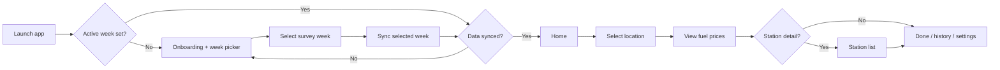
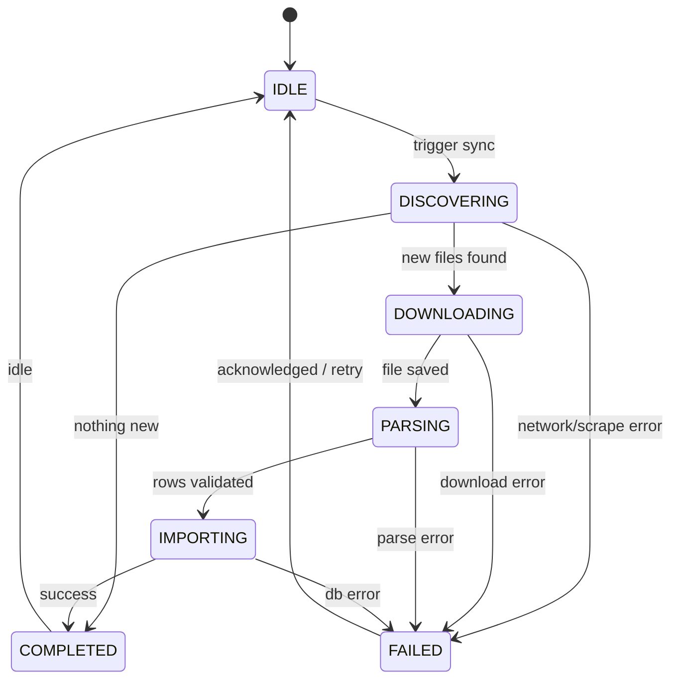

# User Business Logic

> **Contract document.** Defines how the ANP Fuel Prices app behaves from the user's perspective.
> All implementation must follow this document and `.cursor/rules/`.
> In case of conflict, this document and agent core principles prevail.

## Product vision

The user opens the app to **discover official ANP fuel prices** for their city (or any Brazilian municipality), compare products, and optionally see per-station prices — **without an account, without a backend, and without real-time data** (ANP publishes weekly surveys).

All processing happens on the device. The app is a **reader and local index** of public ANP spreadsheets.

---

## Actors

| Actor | Description |
|-------|-------------|
| **End User** | Brazilian consumer or driver looking up fuel prices |
| **System** | Background sync (WorkManager), local database, parsers |
| **ANP (external)** | Publishes weekly XLSX files on gov.br — not controlled by the app |

There is **no authentication** in v1. The End User is anonymous; preferences are stored locally only.

---

## User goals

1. See **current-week average prices** for fuels in my city.
2. **Search** any municipality by name or browse by state.
3. Know **when data was last updated** and whether I am offline.
4. Optionally see **cheapest stations** near my selected city.
5. Optionally see **price history** for my city over past weeks.
6. Trust that data comes from **official ANP sources**.
7. Track **estimated tank fill cost** per registered vehicle on home (UC-011).
8. Get **local alerts** when fuel price drops vs the previous survey week (UC-014).
9. **Skip manual city selection** on first launch by optionally sharing device location (UC-012).
10. **Navigate to a gas station** in Maps or Waze from the station list (UC-013).

---

## Core user journey

### Journey steps (business language)

1. **Launch** — App checks `activeSurveyWeek` preference and local database for imported `SurveyWeek` records (BR-018, BR-019).
2. **Onboarding (first run)** — Explain data source (ANP), offline model, weekly cadence. User **selects survey week** (UC-009) before first sync.
3. **Week selection** — User picks **latest week** or a historical week from the gov.br catalog; optional operational notes shown per week block.
4. **Sync** — Targeted download/import for the selected week only (UC-001 scoped); progress visible.
5. **Home** — Show selected city (or prompt to select), **active week chip** (tap to change week), prices per `FuelProduct` with vector icons, and tank fill cost cards (UC-011).
6. **Location selection** — User picks state + municipality, **searches nationally** by name (IBGE catalog + FTS, UC-004), or **uses device location** once after onboarding (UC-012).
7. **Fuel detail** — Tap a fuel to see min/avg/max, station count, and optional station list.
8. **Vehicles** — Register cars with tank size and fuel type; choose cheapest or specific station for cost estimates (UC-010).
9. **Settings** — Language, sync preferences, storage management, data attribution, week picker shortcut, geocoding attribution.

### Week picker journey (v2 — UC-009)

| Step | User action | System response |
|------|-------------|-----------------|
| 1 | Completes onboarding intro or taps **Survey week** chip / settings | Opens week picker (full screen or bottom sheet) |
| 2 | Taps **Use latest week** | Sets `activeSurveyWeek` to catalog newest; triggers sync (UC-001) |
| 3 | Selects historical week (e.g. `31/05–06/06/2026`) | Confirmation for download; sync scoped to that week |
| 4 | Sync completes | Home/prices reflect selected week; chip shows range + “Latest” badge when applicable |
| 5 | Returns later with cached week | Skips picker; chip allows one-tap week change globally |

**Rules:** BR-006, BR-018, BR-019 — default display follows `activeSurveyWeek`, not implicit “newest in DB” when preference is set.

### National search journey (v2 — UC-004)

| Step | User action | System response |
|------|-------------|-----------------|
| 1 | Types ≥ 2 characters in search (BR-007) | FTS queries `municipality_catalog` (~5 570 IBGE municipalities) |
| 2 | Sees ranked results with **state abbreviation** | BR-017 tiers: exact match → prefix → fuzzy; duplicate names disambiguated |
| 3 | Selects city with no ANP data this week | UC-005 empty state (BR-010), not an error |
| 4 | Works offline | Local FTS only (BR-004); no network required after catalog seed |

**Examples (Appendix A2):** `"san paolo"` → São Paulo (SP); `"Bom Jesus"` → multiple states listed.

---

## Application states (user-visible)

The app exposes a single **DataReadiness** state derived from local storage:

| State | User sees | Transitions to |
|-------|-----------|----------------|
| `EMPTY` | Onboarding: "No data yet. Connect to download ANP tables." | `SYNCING` (first sync started) |
| `SYNCING` | Progress indicator with stage (discover / download / import) | `READY`, `PARTIAL`, or `ERROR` |
| `PARTIAL` | Prices available but station detail missing or sync incomplete | `READY` or `SYNCING` |
| `READY` | Full home experience for latest `SurveyWeek` | `SYNCING` (refresh), `STALE` (time-based) |
| `STALE` | Cached data shown + banner "Data may be outdated" | `SYNCING`, `READY` |
| `ERROR` | Error screen with retry; cached data still shown if any (BR-004) | `SYNCING` |

**Rule:** The UI never blocks reading cached data when sync fails (BR-004, BR-011).

---

## SyncJob state machine

Owned by the **Domain Layer**. UI only observes and displays.

| Transition | Trigger | Allowed actor |
|------------|---------|---------------|
| IDLE → DISCOVERING | Manual refresh, periodic WorkManager, first launch | User, System |
| DISCOVERING → DOWNLOADING | New `PriceTable` URL not in local catalog | System |
| DOWNLOADING → PARSING | File checksum/size validated | System |
| PARSING → IMPORTING | BR-001, BR-002 pass | System |
| * → FAILED | Unrecoverable error after retries | System |
| FAILED → IDLE | User taps Retry or auto-backoff elapsed | User, System |

Terminal states per run: `COMPLETED`, `FAILED`. A new sync starts a new run from `IDLE`.

---

## User preferences (local)

Stored on device only. No cloud sync in v1.

| Preference | Type | Default | Business rule |
|------------|------|---------|---------------|
| `preferredState` | `BrazilianState?` | null | BR-012 |
| `preferredMunicipality` | string? | null | BR-012 |
| `preferredFuelProduct` | `FuelProduct?` | null | Highlights on home |
| `locale` | BCP 47 (`en`, `pt-BR`) | system default | i18n rule |
| `syncStationDetail` | boolean | `true` | BR-008 |
| `autoDownloadLatestWeek` | boolean | `true` | BR-020 |
| `stationDetailRetentionWeeks` | int | `12` | BR-013 |
| `autoSyncOnWifi` | boolean | `true` | BR-014 |
| `showPriceHistory` | boolean | `true` | UC-006 |
| `activeSurveyWeek` | `SurveyWeek?` | null | BR-018, BR-019, UC-009 |
| `locationPromptCompleted` | boolean | `false` | UC-012 — show GPS prompt only once |
| `vehicles` | list of `Vehicle` | empty | UC-010, stored in Room (not cloud) |

---

## Feature scope by version

### v1 — MVP (must implement)

- First sync + manual refresh
- Home with municipality averages (latest week)
- Search city (FTS) + filter by state
- Fuel product list with avg/min/max
- Offline read + sync status banner
- Settings: language, data attribution, clear cache
- i18n: `en` + `pt-BR`

### v1.1 — Enhanced

- Station-level prices (included in sync by default; optional opt-out in Settings)
- Price history chart per fuel (last N weeks)
- Compare two `SurveyWeek`s side by side

### v2 — Week picker, national search, polish (shipped v2.0.0)

- **Survey week selection** before sync (UC-009) — gov.br catalog parity, historical weeks on demand
- **National municipality search** — IBGE baseline catalog + FTS ranking (BR-016, BR-017)
- **Edge-to-edge safe areas** — `AnpScaffold` on all screens (Phase 13)
- **Fuel product vector icons** — per-fuel MDI icons with accessible labels (Phase 14)
- Active week chip on app bars; week picker bottom sheet for returning users

### v3 — Vehicles, geolocation, navigation, alerts (planned)

- **Tank fill cost on home** (UC-011) — per-vehicle estimate below survey week label
- **Vehicle profiles** (UC-010) — up to 3 vehicles, one `FuelProduct` each
- **Optional device location** (UC-012) — Nominatim reverse geocode on first launch
- **Station navigation** (UC-013) — open Maps/Waze from station list
- **Local price drop notifications** (UC-014) — after weekly sync, no backend

### Out of scope (v1)

- User accounts / login
- Real-time prices
- Backend API
- Server-side push notifications

---

## Use case index

Detailed specs live in `docs/use-cases/`. **Do not implement undocumented use cases.**

| ID | Name | Actor | Doc |
|----|------|-------|-----|
| UC-001 | Sync price tables | User, System | [uc-001-sync-price-tables.md](use-cases/uc-001-sync-price-tables.md) |
| UC-002 | Onboarding and first launch | User | [uc-002-onboarding.md](use-cases/uc-002-onboarding.md) |
| UC-003 | Select location (state + city) | User | [uc-003-select-location.md](use-cases/uc-003-select-location.md) |
| UC-004 | Search municipality | User | [uc-004-search-municipality.md](use-cases/uc-004-search-municipality.md) |
| UC-005 | View municipality fuel prices | User | [uc-005-view-municipality-prices.md](use-cases/uc-005-view-municipality-prices.md) |
| UC-006 | View price history | User | [uc-006-view-price-history.md](use-cases/uc-006-view-price-history.md) |
| UC-007 | View station prices | User | [uc-007-view-station-prices.md](use-cases/uc-007-view-station-prices.md) |
| UC-008 | Manage settings and storage | User | [uc-008-manage-settings.md](use-cases/uc-008-manage-settings.md) |
| UC-009 | Select survey week | User | [uc-009-select-survey-week.md](use-cases/uc-009-select-survey-week.md) |
| UC-010 | Manage vehicles | User | [uc-010-manage-vehicles.md](use-cases/uc-010-manage-vehicles.md) |
| UC-011 | Estimate tank fill cost | User | [uc-011-estimate-tank-fill-cost.md](use-cases/uc-011-estimate-tank-fill-cost.md) |
| UC-012 | Resolve location from device | User | [uc-012-resolve-location-from-device.md](use-cases/uc-012-resolve-location-from-device.md) |
| UC-013 | Navigate to station | User | [uc-013-navigate-to-station.md](use-cases/uc-013-navigate-to-station.md) |
| UC-014 | Fuel price drop alerts | User, System | [uc-014-fuel-price-drop-alerts.md](use-cases/uc-014-fuel-price-drop-alerts.md) |

---

## Business rules catalog (user-facing)

Rules referenced by use cases. Full list maintained in [glossary.md](glossary.md).

| ID | Summary |
|----|---------|
| BR-001 | Valid `SurveyWeek` date range (≤ 7 days) |
| BR-002 | Normalize ANP product labels to `FuelProduct` |
| BR-003 | Price history records are immutable |
| BR-004 | Offline read always serves cache + status indicator |
| BR-005 | Search requires ≥ 1 imported `SurveyWeek` |
| BR-006 | Default displayed week = most recent successfully imported |
| BR-007 | City search requires ≥ 2 characters |
| BR-008 | Station detail syncs by default; opt-out or on-demand when disabled |
| BR-009 | ANP data attribution visible on every price screen |
| BR-010 | Empty municipality yields empty state, not an error |
| BR-011 | Sync failure must not delete existing local data |
| BR-012 | Preferred location persists across sessions |
| BR-013 | Station detail retention follows rolling window preference |
| BR-014 | Background sync respects Wi‑Fi-only preference |
| BR-015 | Only one active `SyncJob` at a time |
| BR-016 | Municipality catalog completeness (IBGE baseline) |
| BR-017 | Intelligent search ranking tiers |
| BR-018 | Week selection required before sync when auto-download latest is disabled |
| BR-019 | Active survey week overrides default-latest display |
| BR-020 | Latest survey week auto-selected and synced unless user opts out |
| BR-021 | Nominatim reverse geocode compliance (rate limit, cache, attribution) |
| BR-022 | One `FuelProduct` per `Vehicle` |
| BR-023 | Tank fill cost and alert price resolution (station → average fallback) |
| BR-024 | Multiple vehicle tank cost cards on home with stable layout |
| BR-025 | Price drop alerts only when price decreases vs previous week |
| BR-026 | Normalized station address for external map navigation |
| BR-027 | Maximum three registered vehicles |

---

## Domain events (user-triggered)

| Event | Triggered by | Payload |
|-------|--------------|---------|
| `CitySelected` | UC-003, UC-004 | municipality, state, surveyWeekId |
| `FuelProductSelected` | UC-005, UC-007 | fuelProduct, municipality, state |
| `SyncRequested` | UC-001 | source: `MANUAL` \| `SCHEDULED` \| `FIRST_LAUNCH` |
| `StationDetailRequested` | UC-007 | surveyWeekId, municipality, state |
| `PreferencesUpdated` | UC-008 | changed keys |
| `CacheCleared` | UC-008 | scope: `ALL` \| `STATION_DETAIL_ONLY` |
| `SurveyWeekSelected` | UC-009 | surveyWeek, selectionMode: `LATEST` \| `SPECIFIC` |
| `VehicleRegistered` | UC-010 | vehicleId, displayName, fuelProduct |
| `VehicleUpdated` | UC-010 | vehicleId, changed fields |
| `VehicleRemoved` | UC-010 | vehicleId |
| `PriceDropAlertConfigured` | UC-014 | vehicleId, enabled, alertPriceSource |
| `DeviceLocationResolved` | UC-012 | state, municipality |
| `StationNavigationRequested` | UC-013 | cnpj, stationNavigationQuery |

---

## Error handling (user experience)

All errors use a **structured error model** in Application layer; UI maps to i18n strings.

| Code | User message (i18n key) | Recovery |
|------|-------------------------|----------|
| `SYNC_NETWORK_ERROR` | `error_sync_network` | Retry button |
| `SYNC_PARSE_ERROR` | `error_sync_parse` | Retry; log for support |
| `SYNC_NO_NEW_DATA` | `info_sync_up_to_date` | Informational, not failure |
| `SEARCH_NO_RESULTS` | `error_search_no_results` | Widen search / pick state |
| `STATION_DETAIL_NOT_SYNCED` | `error_station_detail_missing` | Offer download (UC-007) |
| `STORAGE_FULL` | `error_storage_full` | Link to settings (UC-008) |

---

## Data freshness rules

| Condition | UI behavior |
|-----------|-------------|
| Latest week imported < 8 days ago | Show week range only (normal) |
| Latest week imported ≥ 8 days ago | Show `STALE` banner + refresh CTA |
| No network + cache exists | Show offline banner (BR-004) |
| No network + no cache | Show onboarding/sync required |

ANP typically publishes weekly; the 8-day threshold allows for publication delay.

---

## Privacy and compliance

- **No account or cloud sync** — preferences and vehicles stored on device only.
- **Optional device location** (UC-012) — one-shot GPS for municipality resolution; coordinates not persisted.
- **Nominatim** — reverse geocode calls subject to OSM usage policy; results cached locally (BR-021).
- **Local notifications** (UC-014) — generated on device after sync; no push backend.
- CNPJ and station addresses are **public ANP data** — display as-is, no masking required.
- No analytics SDK without explicit future ADR.
- LGPD: location and notifications require transparent disclosure in privacy policy and runtime permission prompts.

---

## Implementation checklist

Before coding a feature:

- [ ] Use case document exists and is approved
- [ ] Business rules referenced are listed in glossary
- [ ] Domain events identified
- [ ] State machine transitions validated (if applicable)
- [ ] i18n keys listed for all user-visible strings
- [ ] Unit tests written (GIVEN/WHEN/THEN) for domain rules
- [ ] Empty, loading, error UI states defined
